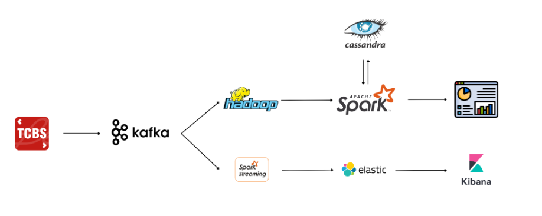

# Báo cáo BTL

Status: Not started

## Bài toán:

Lưu trữ và xử lý dữ liệu chứng khoán với dữ liệu được thu thập từ API của Công ty Cổ phần Chứng khoán Kỹ Thương (Techcom Securities – TCBS), là công ty con của Ngân hàng TMCP Kỹ Thương Việt Nam Techcombank.

## Kiến trúc hệ thống



## Dữ liệu được lưu trong Cassandra


## Spark

1. Batch Processing:
    - Spark đọc dữ liệu chứng khoán cuối ngày từ Hadoop, thực hiện tiền xử lý dữ liệu và lưu vào Cassandra
    
    
    
    - Spark đọc dữ liệu từ cassandra và tiến hành thống kê, hiển thị cho người dùng:
    
    
    
2. Streaming:
    - Spark Streaming nhận dữ liệu trực tiếp từ Kafka Producer, thực hiện một số thống kê và hiển thị dữ liệu realtime cho người dùng
    
    
## Install project

1. Install all package in file requirement.txt
   > pip install -r requirement.txt
2. Run docker
   > docker-compose up
   > If datanode crash to an error related to port, then change the port of datanode.
3. Enable safe mode in namenode
   > docker exec -it namenode /bin/bash 
   >
   > hdfs dfsadmin -safemode leave
   >
   > exit
4. Add hostname to C:\Windows\System32\drivers\etc\hosts.txt
   > 127.0.0.1 datanode-1
   >
   > 127.0.0.1 datanode-2
   >
   > 127.0.0.1 datanode-3
5. Add folder logs in folder consumer, producer

## Run

1. Run file producer
   > for /f %i in ('python -m certifi') do set SSL_CERT_FILE=%i
   >
   > python kafka/producer/app.py
2. Run file consumer
   > python kafka/consumer/app.py

3. Run spark

   ``` copy file spark.py to spark-master ```
   >
   > docker cp spark/spark.py spark-master:/home/

   copy file analyzer.py to spark-master
   > docker cp spark/analyzer.py spark-master:/home/


   Access spark-master to run it
   >
   > docker exec -it spark-master bash
   >
   >spark/bin/spark-submit --conf spark.cassandra.connection.host=172.23.0.11 --packages com.datastax.spark:spark-cassandra-connector_2.12:3.2.0 --conf spark.cassandra.auth.username=cassandra --conf spark.cassandra.auth.password=cassandra --master spark-master:7077 home/spark.py

   Truyen argv vao -- argv[1] + argv[2]: statistic + date (format yyyy-mm-dd) / history + ticker 
   > spark/bin/spark-submit --conf spark.cassandra.connection.host=172.23.0.12 --packages com.datastax.spark:spark-cassandra-connector_2.12:3.2.0 --conf spark.cassandra.auth.username=cassandra --conf spark.cassandra.auth.password=cassandra --master spark-master:7077 home/analyzer.py

   
   !!! cassandra host, copy ip cassandra below
   >
   > docker network inspect big-data_es-net
   >
   !!! kafka spark stream
   >
   > spark/bin/spark-submit --packages org.apache.spark:spark-sql-kafka-0-10_2.12:3.3.1 --master local --class "org.myspark.KafkaStream" home/stream.py
   >
